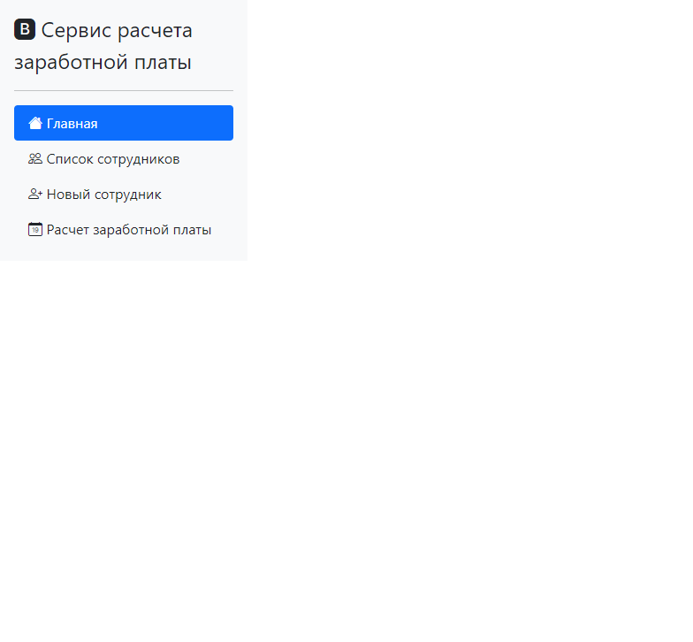
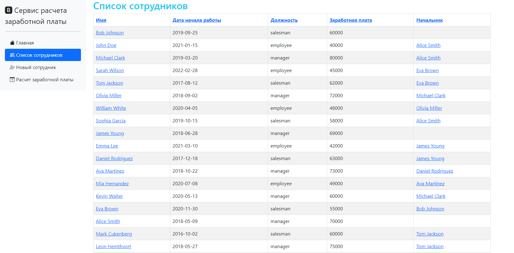
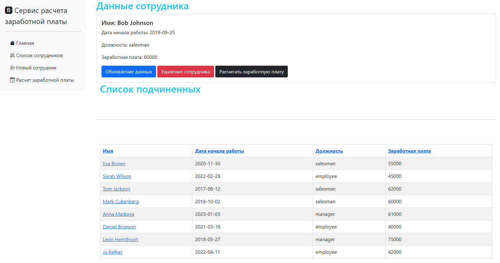
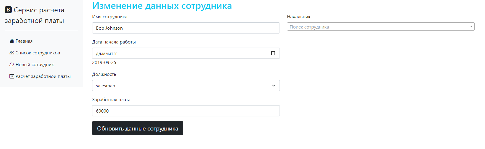
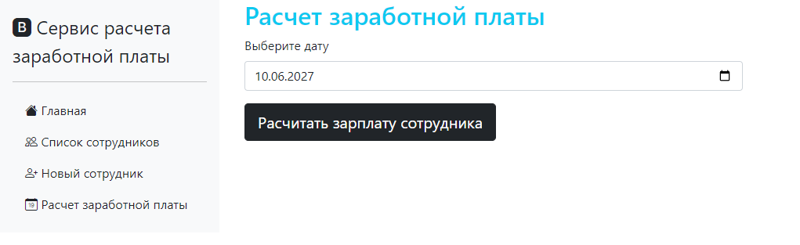
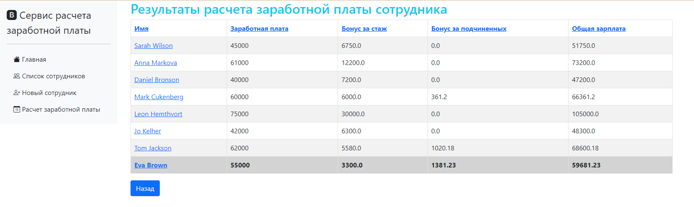
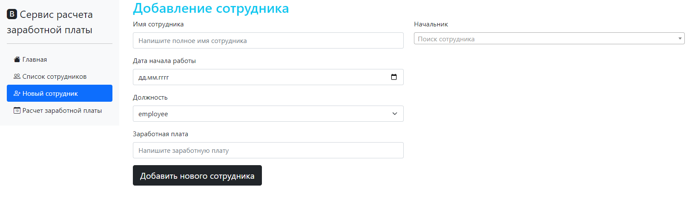
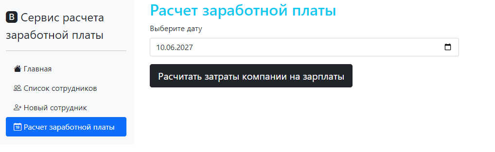
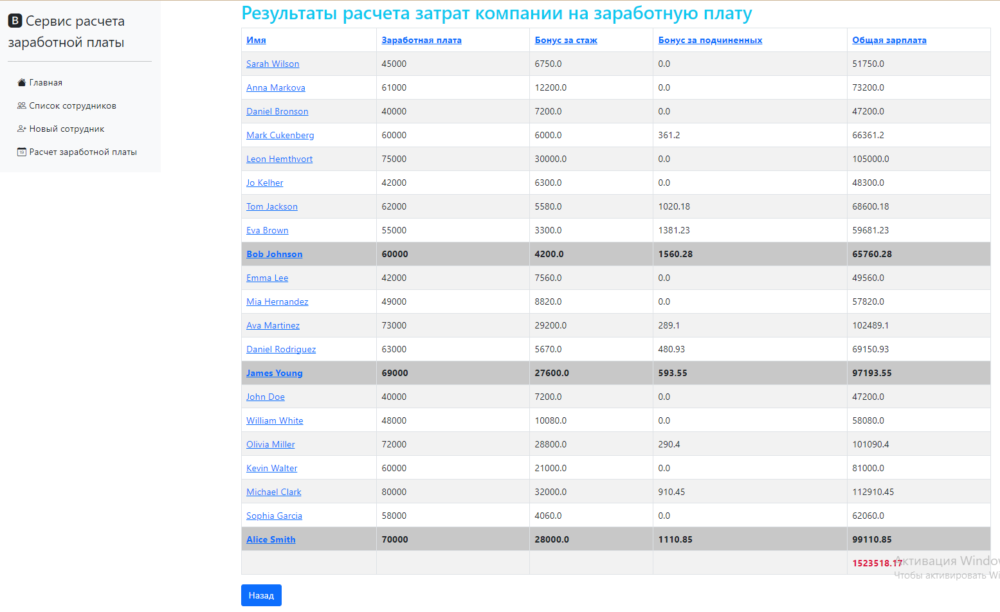

# Тестовое задание

### Описание задачи

В рамках тествого задания было предложено реализовать сервис для расчета зарплаты сотрудников компании N на определенную дату, используя фреймворк Spring.

В компании работают сотрудники, характеризующиеся:
* именем
* датой поступления на работу
* группой
* базовой ставкой заработной платы

Есть 3 группы сотрудников:
* **Employee** — не имеет подчиненных и получает плюс 3% за каждый год работы, но не более 30% суммарной надбавки.
* **Manager** — имеет бонус от подчиненных первого уровня (0.5% зарплаты), а также получает плюс 5% за каждый год работы, но не более 40% суммарной надбавки.
* **Salesman** — имеет бонус от подчиненных всех уровней (0.3% зарплаты), а также получает плюс 1% за каждый год работы, но не более 35% суммарной надбавки.

### Реализация задачи

#### Создание базы данных

В качестве СУБД была использована PostgreSQL. В базе данных созданы один перечисляемый тип `group_type` и одна таблица для представления сотрудников `employee`.  На рисунке ниже пердставлена схема таблицы.

#### Архитектура приложения

Web-приложение состоит из 3 контроллеров, 2 сервисов, 1 репозитория, 1 класса-конвертера. Данные инкапсулируются в 1 модели и вспомогательном классе. Также присутствует `<Enum>`  для хранения типов групп сотрудников.

* *EmployeeController* — контроллер, обрабатывающий запросы, связанные с представлением данных осотрудниках
* *SalaryController* — контроллер, обрабатывающий запросы, связанные с заработной платой
* *HomeController* — контроллер, обрабатывающий представление главной страницы
* *EmployeeService* — сервис для предоставления и работы с данными о сотрудниках 
* *SalaryService* — сервис для управления заработными платами сотрудников
* *EmployeeRepository* — репозиторий для управления объектами `<Employee>`
* *Employee* — сущность, представляющая сотрудника
* *EmployeeBonus* — класс для хранения информации о компонентах заработной платы сотрудника
* *GroupNumber* — перечисление, определяющее должности сотрудников и связанные с ними коэффициенты надбавок
* *StringToLocalDateConverter* — конвертер для преобразования строки в `<LocalDate>`

Интерфейс web-приложения состоит из 7 HTML-страниц. 

* *home* — главная страница приложения
* *allEmployees* — страница с данными о всех сотрудниках
* *employeeCard* — страница с информацией о конкретном сотруднике
* *createEmployee* — страница с формой для создания нового сотрудника
* *updateEmployee* — страница с формой для изменения данных сотрудника
* *salaryPre* — страница с формой выбора даты для расчета заработной платы
* *salaryResult* — страница с результатами расчета заработной платы

Код web-приложения разработан с учетом удобства использования и доступности, что обеспечивает понятный интерфейс для пользователей. Кроме того, он написан таким образом, что его легко можно модифицировать и улучшать без необходимости переписывания с нуля. 

### Инструкция по использованию сервиса

После запуска web-приложения пользователь попадет на главную страницу с панелью навигации в левом верхнем углу.

Перейдя на вкладку `Список сотрудников` пользователь может ознакомится со всеми сотрудниками, зарегестрированными в компании N. 

В случае необходимости пользователь может нажать на имя любого сотрудника и перейти на его личную страницу. На ней отображена подробная информация, добавлены кнопки для изменения и удаления сотрудника, а также расчета его заработной платы.

Если пользователь нажмет кнопку `Обновление данных`, то он перейдет на страницу с формой для обновления данных выбранного сотрудника.

Изменив все поля и нажав кнопку `Обновить данные сотрудника`, в случае, если все заполнено корректно, пользователь вернется на страницу сотрудника и в правом верхнем углу появиться уведомление об успешном изменении, иначе пользователь останется на странице с формой и ему укажут на ошибку.

Если пользователь нажмет кнопку `Удаление сотрудника`, то он перейдет на страницу со списком сотрудников, где в правом верхнем углу появиться уведомление об успешном удалении.

Если пользователь нажмет кнопку `Расчитать заработную плату`, то он перейдет на страницу с формой для выбора дата, на момент которой необходимо расчитать заработную плату сотрудника.

Нажав кнопку `Расчитать зарплату сотрудника`,  пользователь перейдет на страницу с таблицей, в которой подробно расписано из каких составялющих формируется зарплата сотрудника на выбранную дату (нижняя строка, выделенная серым фоном). Есть возможность вернуться назад и повторить шаги по выбору даты и расчета зарплаты.

Вернемся к навигационной панели. При переходе на вкладку `Новый сотрудник` пользователю откроется страница с формой заполнения данных для создания нового сотрудника компании. Заполнив данные и нажав кнопку `Добавить нового сотрудника`, пользователь перейдет на страницу ранее добавленного сотрудника, где в правом углу отобразится уведомление об успешном создании.

Последняя вкладка на навигационной панели — `Расчет заработной платы` предназначена для расчета затрат компании на зарплату сотрудников в выбранную дату. При переходе на данную вкладку пользователю откроется страница с выбором даты. 

Нажав кнопку `Расчитать затраты компании на зарплаты`,  пользователь перейдет на страницу с таблицей, в которой подробно расписаны размеры зарплаты всех сотрудников. Серым выделены сотрудники, у которых нет начальника. Красным выделено значени затрат компании на зарплаты на выбранную дату.

